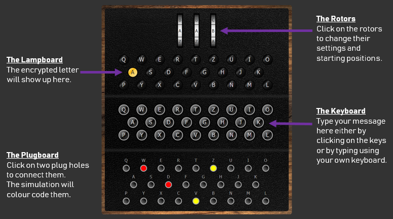
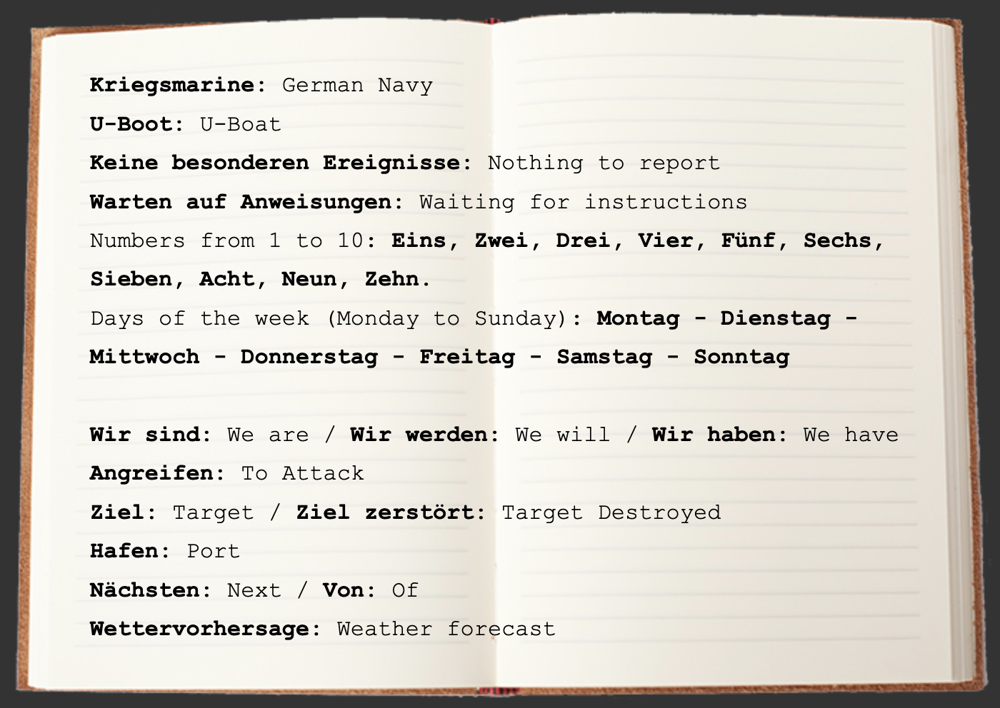

# Enigma – Mission X Challenge

- [Enigma – Mission X Challenge](#enigma--mission-x-challenge)
  - [Background](#background)
  - [Dependency](#dependency)
  - [Enigma Machine](#enigma-machine)
  - [Revisit Basic Cipher Methods](#revisit-basic-cipher-methods)
  - [Turing-Welchman Bombe Simulator](#turing-welchman-bombe-simulator)
  - [Credits](#credits)
  - [Reference](#reference)

## Background
Inspired by [Enigma - Mission X Challenge](https://www.101computing.net/enigma-mission-x-challenge/), this repo is used to save the research and practice efforts in Different Cipher methods. The primary goals are using python programming language to achieve targets listed as follows:

- [X] Revisit Basic Cipher Methods
- [X] Digital Enigma Cipher Machine Emulator
- [ ] Turing-Welchman Bombe Simulator
- [ ] Story Telling & Knowledge Sharing

## Dependency

- python 3.11 (use conda or pyenv)
- pandas
- matplotlib

Python 3.11 is used for development work, and I believe python version 3.8, 3.9, 3.10 are all OK. FYI, python 3.11 is about 25% faster than 3.10[python-speedy](https://github.com/cuicaihao/python-speedy) for details.

You will need to install `pandas` and `matplotlib` for Excel operation and plot figures.

## Enigma Machine

Take a step by step tutorial by [notebook:Chapter_B_Enigma](notebook/Chapter_B_Enigma.ipynb) to develope a Enigma Machine in python.

Eventually, use the Enigma Cipher Machine Emulator to accomplish the [Mission X](https://www.101computing.net/enigma/).

Here is the final output for the code for the [Mission X](https://www.101computing.net/enigma/).

| Date       | Ciphertext                             | Plaintext_German                       | Translation_English           |
|------------|----------------------------------------|--------------------------------------|-------------------------------|
| 1940-04-07 | SYTUN TJBFC BRSSY XNPKQ QZMDW          | Keine besonderen ereignisse          | Noting to report              |
| 1940-04-11 | SDPNV OLDCQ HIBMK QTONC VNZXU SKSPZ IW | Wir werden nachsten montag angreifen | We will next Monday to attack |
| 1940-04-12 | OJSBI BUPKA ECMEE ZH                   | Ziel hafen von DOVER                 | Target port of DOVER          |
| 1940-04-12 | REVNU XWYCV HZFSH NFMSP                | Warten auf Anweisungen               | Waiting for instructions      |

## Revisit Basic Cipher Methods

Take a step by step tutorial by [notebook: Basic_Cipher](notebook/Chapter_A_Basic_Cipher.ipynb), this will help you to get a better understanding of the Enigma machine.

Basic Letter 1 to 1 mapping like [Caesar Cipher](https://en.wikipedia.org/wiki/Caesar_cipher) is very easy to be hacked by comparing and matching letter based on statistic.

By create a multiply mappings and rolling the letter mapping by order, we can mapping the same letter to a different letter in each around, lead to a more even distributed ciphertext.

## Turing-Welchman Bombe Simulator

TBC.

-

## Credits
- Code Credits belong to the Author [Raymas: enigma-cipher-machine](https://github.com/raymas/enigma-cipher-machine).
- Small Changes are made to accomplish the Mission X.

## Reference

- [Caesar Cipher](https://en.wikipedia.org/wiki/Caesar_cipher)
- [Enigma – Mission X Challenge 101 Computing](https://www.101computing.net/enigma-mission-x-challenge/)
- [Turing-Welchman Bombe Simulator](https://www.101computing.net/turing-welchman-bombe-simulator/)
- [Wikipedia: Enigma machine](https://en.wikipedia.org/wiki/Enigma_machine)
- [Wikipedia DE: Enigma-Walzen](https://de.wikipedia.org/wiki/Enigma-Walzen)
- [Pypi: enigma-cipher-machine ](https://pypi.org/project/enigma-cipher-machine/)
