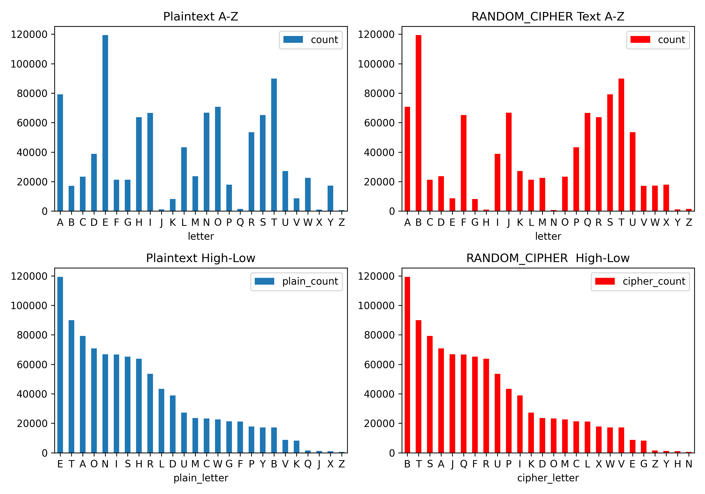
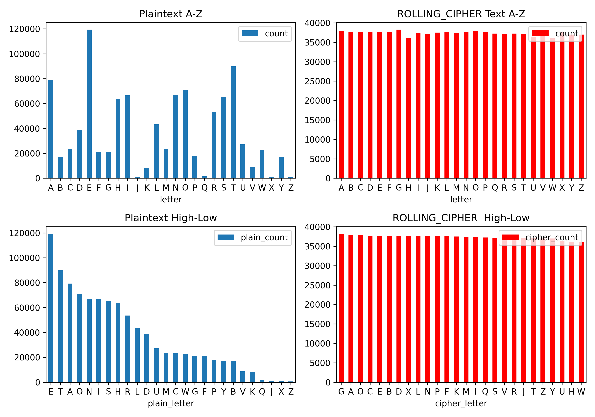

# Enigma – Mission X Challenge

- [Enigma – Mission X Challenge](#enigma--mission-x-challenge)
  - [Background](#background)
  - [Revisit Basic Cipher Methods](#revisit-basic-cipher-methods)
  - [Enigma Machine](#enigma-machine)
  - [Turing-Welchman Bombe Simulator](#turing-welchman-bombe-simulator)
  - [Reference](#reference)

## Background
Inspired by [Enigma - Mission X Challenge](https://www.101computing.net/enigma-mission-x-challenge/), this repo is used to save the research and practice efforts in Different Cipher methods. The primary goals are using python programming language to achieve targets listed as follows:

- [x] Revisit Basic Cipher Methods
- [ ] Digital Enigma Cipher Machine Emulator
- [ ] Turing-Welchman Bombe Simulator
- [ ] Story Telling & Knowledge Sharing

## Revisit Basic Cipher Methods

Basic Letter 1 to 1 mapping like [Caesar Cipher](https://en.wikipedia.org/wiki/Caesar_cipher) is very easy to be hacked by comparing and matching letter based on statistic.

By create a multiply mappings and rolling the letter mapping by order, we can mapping the same letter to a different letter in each around, lead to a more even distributed ciphertext.

## Enigma Machine

TBC.

## Turing-Welchman Bombe Simulator

TBC.

## Reference

- [Caesar Cipher](https://en.wikipedia.org/wiki/Caesar_cipher)
- [Enigma – Mission X Challenge 101 Computing](https://www.101computing.net/enigma-mission-x-challenge/)
- [Turing-Welchman Bombe Simulator](https://www.101computing.net/turing-welchman-bombe-simulator/)
- [Wikipedia: Enigma machine](https://en.wikipedia.org/wiki/Enigma_machine)
- [Wikipedia DE: Enigma-Walzen](https://de.wikipedia.org/wiki/Enigma-Walzen)
- [Pypi: enigma-cipher-machine ](https://pypi.org/project/enigma-cipher-machine/)
