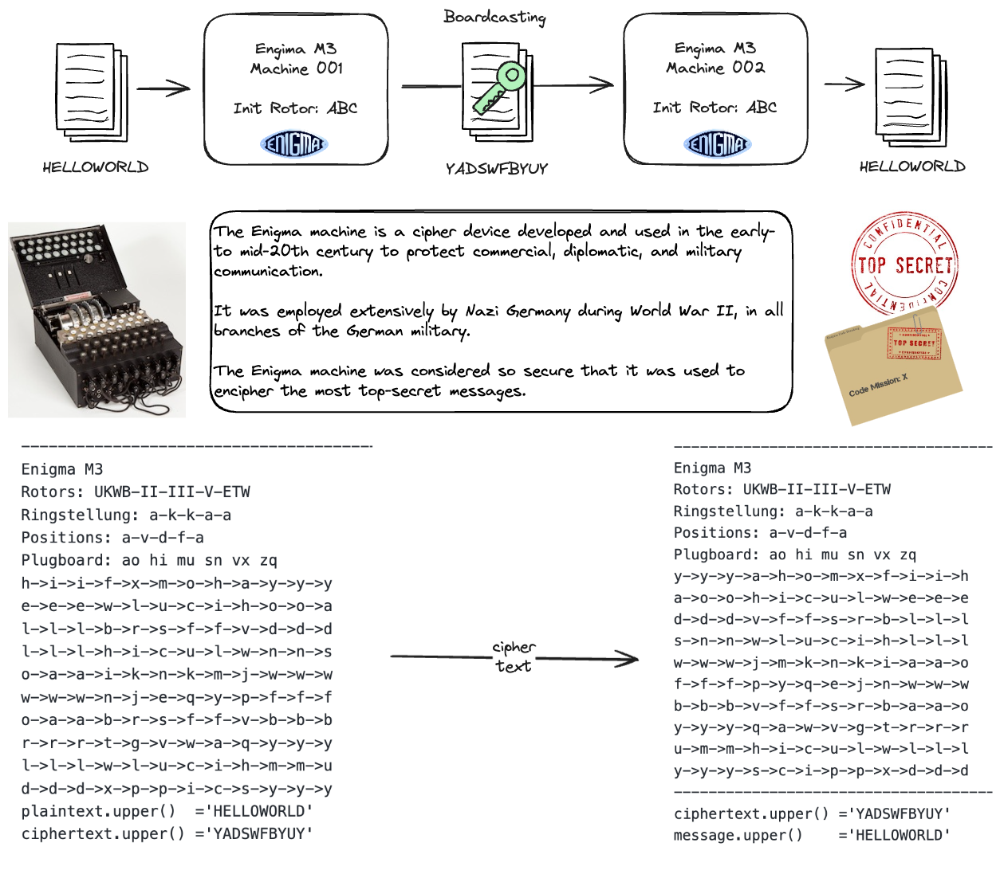

# Enigma – Mission X Challenge 
 

Inspired by [Enigma - Mission X Challenge](https://www.101computing.net/enigma-mission-x-challenge/), this repo is used to save the research and practice efforts in Different Cipher methods. The primary goals are using python programming language to achieve targets listed as follows:
- [ ] Digital Enigma Cipher Machine Emulator 
- [ ] Turing-Welchman Bombe Simulator
- [ ] Story Telling & Knowledge Sharing
 
## Revisit Basic Cipher Method
 
## Enigma Machine

## Turing-Welchman Bombe Simulator

#### Reference

- [Enigma – Mission X Challenge 101 Computing](https://www.101computing.net/enigma-mission-x-challenge/)
- [Turing-Welchman Bombe Simulator](https://www.101computing.net/turing-welchman-bombe-simulator/)
- [Wikipedia: Enigma machine](https://en.wikipedia.org/wiki/Enigma_machine)
- [Wikipedia DE: Enigma-Walzen](https://de.wikipedia.org/wiki/Enigma-Walzen)
- [Pypi: enigma-cipher-machine ](https://pypi.org/project/enigma-cipher-machine/)